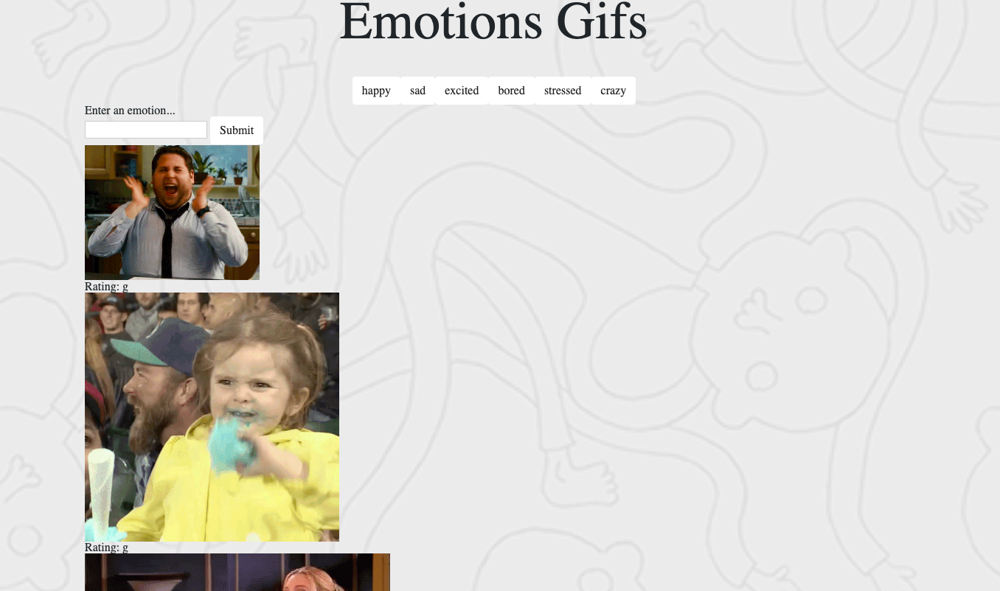

# GifTastic
Assignment from Rutgers Coding Bootcamp week 6: In this assignment,  you'll use the GIPHY API to make a dynamic web page that populates with gifs of your choice. To finish this task, you must call the GIPHY API and use JavaScript and jQuery to change the HTML of your site.

You can play around with this online at https://jk1138.github.io/GifTastic/.

# How to play:
Please click on the word buttons to get 10 gifs related to that emotion. In order to get a gif to move please click on the image and it will begin to move but once you would like the image to stop rendering please hit the iage again and it will stop. 
If you would like to see other gifs (possibly related to emotions or reactions) please enter a term into the search box. Once you hit submit, a button will appear next to the given buttons and if you hit the new button 10 gifs will appear.

# Technology:
This Gif-Tastic game was created using:

- HTML
- CSS
-JavaScript
- jQuery
- AJAX
- giphy API

